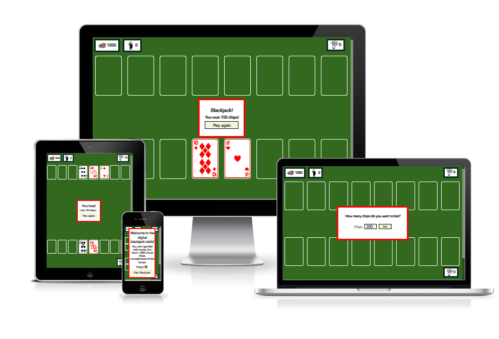
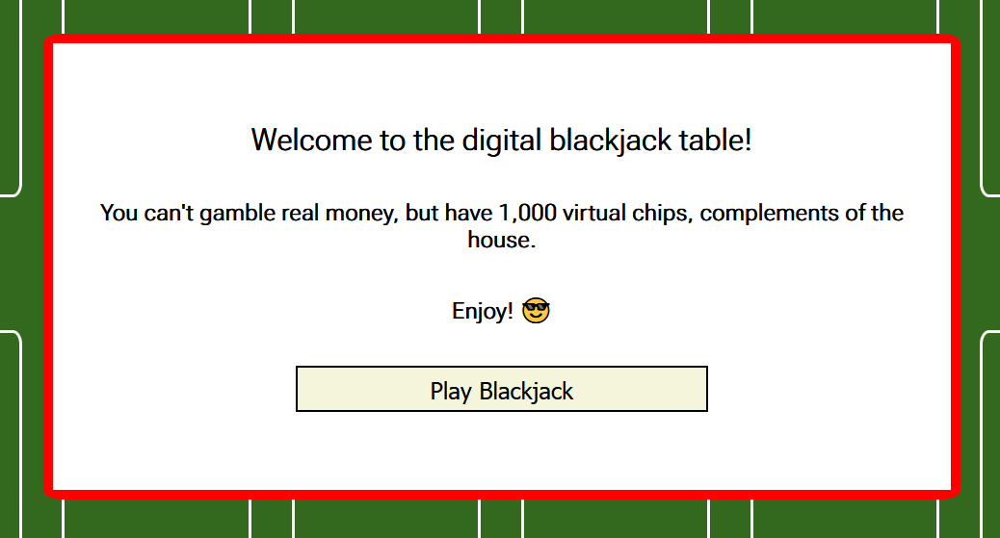
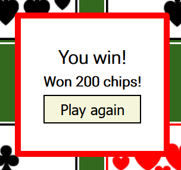
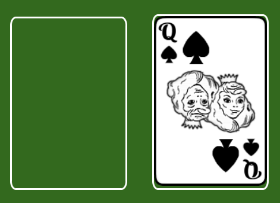
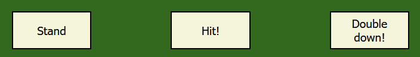
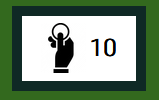
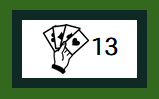
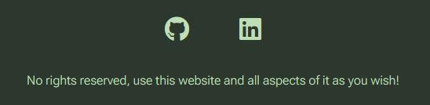

# Blackjack

[Blackjack](https://ocassidydev.github.io/blackjack/) is a simple web app game that allows the player to gamble virtual chips on blackjack, with a script as the dealer. The site will be targeted towards people who are looking to kill some time and have fun. Blackjack will be useful to anyone who would like to practice the basics of card counting to master this classic casino game. 

&nbsp;
## Features 

### Existing Features
- __Central message boxes__

    - These are divs which appear and disappear for the user depending where the accompanying script is in its flow control.
    - Fixed in place at the center of the screen's interface so the user will easily see them.
    - The first message box welcomes the player and gives them their chips.
    - The second message box contains a form which allows the player to set their bet for that particular round.
    - The third message box is dynamic in its content, updating from the script depending on if the player get blackjack, wins, loses, or ties.
    - This will be valuable to the user as a means of conveying what is happening in the game, and immersing them in the blackjack experience.
    \
    &nbsp;
    
    

&nbsp;
- __Card boxes__

    - These are divs which are placed in fixed positions on the screen, with responsive sizing.
    - They show where cards will go when played, and accomodate card images when they are in play.
    - This will be valuable to the user as they give the feeling of a casino table and display the current cards in play.
    \
    &nbsp;
    

&nbsp;
- __Player controls__

  - These are a set of buttons which will only appear when the user needs to press them as input for the game.
  - Each button causes a unique set of events to occur in the accompanying script, representing the 3 options in a round of blackjack.
  - This feature will add value for the user by giving them a means of controlling their hand in the game.
  \
  &nbsp;
  

&nbsp;
- __Chip wallet__ 

  - This is a div containing the current number of chips that the player has.
  - The value within is dynamically updated from the accompanying javascript based on whether the player wins or loses bets.
  - This will add value to the user as they will be able to keep track of how much they have won or lost.
  \
  &nbsp;
  

&nbsp;
- __Current bet display__

  - This is a div containing the current bet value the player has made. 
  - The value within also dynamically updates from the accompanying javascript, using the value the user inputs in the form to set its value.
  - This will add value to the user as they will be able to remember what they bet during a round. 
  \
  &nbsp;
  

&nbsp;
- __Hand value display__ 

  - These are divs which contain the value of the hands of cards they are placed beside.
  - The values in these also dynamically update, showing the face value of all cards currently in the player/dealer's hand.
  - This will be valuable to the user as they will be more easily able to figure out what the current tally of their hand and the dealer's hand, especially if they are less familiar with the rules of blackjack.
  \
  &nbsp;
  

&nbsp;
- __The Footer__

  - The footer contains some social media links and a nice message.
  - The links utilize font awesome icons to give a minimalistic look.
  - This will be valuable to the user as a way of figuring out who made the site and what they can do with it.
  \
  &nbsp;
  

&nbsp;
### Features Left to Implement

&nbsp;

***Persistent chip wallet***

I wanted to implement a way to cache the user's current chip wallet in the browser, such that even if they close the tab or refresh it will still be there. This would also be accompanied by a different welcome message than the default, so that they realize they can pick up where they left off. One way to do this may be to let the user set a username as the first message box, which could then be saved as the name of a cookie which would then be retrieved if they put the same username in next time. The cookie could contain an object which would have the player's chip wallet stored on it.

&nbsp;

***Slowed sequential card dealing***

I also wanted to make the cards land on the table in a non-instantaneous, sequential fashion to give a more realistic card game feel. However, the way that my javascript was designed would make that very difficult to design. If I were to attempt it, I would try to implement a solution using promises, along with likely redesigning the flow control of much of startRound(), continueRound() and dealerPlay().
&nbsp;

***Card dealing animations***

I also wanted to add a means of having the cards animate as they appeared, preferably by moving from something graphical element that is stylized like a deck and to flip over from face down. This could be acheived in css at least in part, however until I can get cards to play sequentially doing this is redundant, the game would just skip to the round end messages while the player is still seeing card dealing animations and it would be too confusing. The same redesign as mentioned above would need to be implemented first.

&nbsp;

## Testing 
### Central message box
- The following table goes through each button that appears in the central message boxes, with columns detailing what the button should do when clicked, what it does when clicked, and a check to validate whether these buttons can be considered working or not.

|Button in box          |Expected Behavior                                  |What Occurs                                        |Working as intended?   |
|:----------------------|:--------------------------------------------------|:--------------------------------------------------|:---------------------:|
|Play Blackjack         |Gives 1000 chips and opens bet prompt              |Starts round and opens bet prompt                  |✔                     |
|Play again (lose)      |Clears table and opens bet prompt                  |Clears table and opens bet prompt                  |✔                     |
|Play again (win)       |Clears table and opens bet prompt                  |Clears table and opens bet prompt                  |✔                     |
|Play again (blackjack) |Clears table and opens bet prompt                  |Clears table and opens bet prompt                  |✔                     |
|Thanks                 |Gives 1000 chips, clears table and opens bet prompt|Gives 1000 chips, clears table and opens bet prompt|✔                     |
|Run away               |Refreshes page                                     |Refreshes page                                     |✔                     |

\
&nbsp;

### Bet input form
- The following table goes through each element of the bet input form, with columns detailing what the button should do when clicked, what it does when clicked, and a check to validate whether these buttons can be considered working or not.

|Element of form    |Expected Behavior                                                                                      |What Occurs                                                                                            |Working as intended?   |
|:------------------|:------------------------------------------------------------------------------------------------------|:------------------------------------------------------------------------------------------------------|:---------------------:|
|Number input       |Can only be set between 10 and 200 OR the chipwallet value, whichever is lowest, in increments of 10   |Can only be set between 10 and 200 OR the chipwallet value, whichever is lowest, in increments of 10   |✔                     |
|Submit bet! button |Updates bet value from form, closes message box, displays player controls and begins round             |Updates bet value from form, closes message box, displays player controls and begins round             |✔                     |

\
&nbsp;
### Player controls
- The following table goes through each button on player controls, with columns detailing what the button should do when clicked, what it does when clicked, and a check to validate whether these buttons can be considered working or not.

|Button on bar      |Expected Behavior                                                                                          |What Occurs                                                                                                |Working as intended?   |
|:------------------|:----------------------------------------------------------------------------------------------------------|:----------------------------------------------------------------------------------------------------------|:---------------------:|
|Stand              |Hides player controls and begins dealer's turn                                                             |Hides player controls and begins dealer's turn                                                             |✔                     |
|Hit!               |Hides double down button and adds one card to hand, then checks if hand >= 21, waits for user input if not |Hides double down button and adds one card to hand, then checks if hand >= 21, waits for user input if not |✔                     |
|Double down!       |Doubles bet value, hides player controls, checks if hand >= 21, begins dealer turn if not                  |Doubles bet value, hides player controls, checks if hand >= 21, begins dealer turn if not                  |✔                     |

\
&nbsp;

### Links
**Links in Footer**

These were checked across each page of the website.

|Link                                   |Expected Behavior                                                                      |What Occurs                                                                            |Working as intended?   |
|:--------------------------------------|:--------------------------------------------------------------------------------------|:--------------------------------------------------------------------------------------|:---------------------:|
|Github                                 |Opens [my Github](https://github.com/ocassidydev) in new tab                           |Opens [my Github](https://github.com/ocassidydev) in new tab                           |✔                     |
|LinkedIn                               |Opens [my LinkedIn](https://www.linkedin.com/in/oran-cassidy-48aa021b8/) in new tab    |Opens [my LinkedIn](https://www.linkedin.com/in/oran-cassidy-48aa021b8/) in new tab    |✔                     |

&nbsp;

### Different viewports
Throughout the project, the appearance of the website was checked using firefox dev tools set devices. I also quickly browsed through the finished site on my phone.

&nbsp;
### Bugs 

  - Bug where if the player ran out of chips and was given the message giving them more, the button in the end message in subsequent rounds had "Thanks" as the text rather than "Play again"
  - On certain small viewports, the card slots show up as taking more space than the page width and one ends up getting displaced below the others, despite this not being the case on other similarily size viewports and in dev tools.
  - Although the array of cards in the deck is shuffled using the Fisher-Yates method as opposed to Math.random(), it seems this doesn't significantly increase the randomness of the deck either way. Different suits seem highly correlated. Might be some way to generate the list of card objects more randomly, such as passing an array 1 through 13 that itself has been shuffled first for the deck constructor.

&nbsp;
### Validator Testing 

- HTML
  - No errors were returned when passing through the official [W3C validator](https://validator.w3.org/nu/?doc=https%3A%2F%2Focassidydev.github.io%2Fnanonow%2Findex.html), with exception to one warning regarding the use of a label in an anchor tag (which was necessary for it to work as intended)
- CSS
  - No errors were found when passing through the official [(Jigsaw) validator](https://jigsaw.w3.org/css-validator/validator?uri=https%3A%2F%2Focassidydev.github.io%2Fnanonow%2Findex.html&profile=css3svg&usermedium=all&warning=1&vextwarning=&lang=en)

&nbsp;
### Unfixed Bugs

   - Bug where hamburger icon fails to load in quick enough on page load.
   - Some pages on the site have a lower than desired lighthouse performance score (materials - 88, applications - 78). This is likely due to the quantity of images in the site and a lack of complete optimisation of image formats. This may cause slower loading times.
   
&nbsp;
## Deployment

- This project was deployed through github pages at this [link](https://ocassidydev.github.io/nanonow/contact.html), using the following steps:

  - From the github repository, navigated to settings
  - Clicked on "Pages" 
  - On the drop down menu that read "none", clicked and changed to "main"
  - Clicked save

&nbsp;

- For local deployment, run the following command:

      git clone https://github.com/ocassidydev/nanonow.git

&nbsp;
## Credits 

### Code

- The hamburger menu was created with code from a page on [Code-Boxx](https://code-boxx.com/simple-responsive-pure-css-hamburger-menu/).
- Centering the page titles in the image div was obtained from css code on [hubspot](https://blog.hubspot.com/website/center-div-css)
- A number of individual queries and fixes were sought on [Stack Overflow](https://stackoverflow.com/).
- For refreshing certain concepts and documentations, I used [W3S Schools](https://www.w3schools.com/).

&nbsp;
### Content 

- Inspiration was taken from [nano.gov](https://www.nano.gov/about-nanotechnology/applications-nanotechnology) and [Wikipedia's Applications of Nanotechnology page](https://en.wikipedia.org/wiki/Applications_of_nanotechnology) to populate the site content.
- I used various wikipedia pages on the topic to check my knowledge as I was entering content.
- The icons in the footer were taken from [Font Awesome](https://fontawesome.com/).

&nbsp;
### Media

The following lists each image by their name in the /assets/images folder, with a link to the site they were taken from. Where possible, they are listed in order of appearance.

- __Homepage__
  - graphene - [SingularityHub](https://singularityhub.com/2018/08/05/beyond-graphene-the-promise-of-2d-materials/)
  - bodyarmor - [Pinterest](https://www.pinterest.ie/pin/warriors-of-honor--534661786985745203/)
  - solarpanels - [Wiley Online Library](https://onlinelibrary.wiley.com/doi/toc/10.1002/(ISSN)2567-3165.perovskite-materials)
  - nostain - [LinkedIn](https://www.linkedin.com/pulse/our-fluid-repellent-stain-resistant-clothing-uniforms-manavalan/?trk=portfolio_article-card_title)
  - hydrogen - [Fine Art America](https://fineartamerica.com/featured/hydrogen-fuel-cell-concept-car-jim-west.html?product=art-print)
  
  - humanheight - [Engineering Stack Exchange](https://engineering.stackexchange.com/questions/21200/what-is-best-sensor-method-to-measure-human-height)
  - coin - [Etsy](https://www.etsy.com/ie/listing/783952494/coin-1-euro-latvia-2014-latvijas)
  - pinhead - [Fine Art America](https://fineartamerica.com/featured/pin-head-and-point-dennis-kunkel-microscopyscience-photo-library.html)
  - hair - [Micropedia](https://microspedia.blogspot.com/2017/09/microscope-view-of-hair.html)
  - nanoscale - [Dartmouth Undergraduate Journal of Science](https://sites.dartmouth.edu/dujs/2009/02/22/turning-to-nanotechnology-for-pollution-control-applications-of-nanoparticles/)

- __Materials page__
  - buckies - https://www.chemistryworld.com/news/buckyballs-prove-to-be-a-magnetic-proposition-for-copper/8833.article

  - metalnanoparticle - [Anton Paar](https://www.anton-paar.com/se-en/products/applications/size-and-shape-of-gold-nanoparticles-in-toluene-via-saxs/)
  - buckyball - [Buckminister Fuller Institute](https://www.bfi.org/about-fuller/big-ideas/buckminsterfullerene/)
  - liposome - [Skeptical Raptor](https://www.skepticalraptor.com/skepticalraptorblog.php/lipid-nanoparticles-in-covid-19-mrna-vaccines-ican-fails-science/)

  - cntsingle - [The World of Nanoscience](https://worldofnanoscience.weebly.com/nanotube--carbon-fiber-overview.html)
  - nanowire - [Physics World](https://physicsworld.com/a/nanowire-thickness-alters-gaas-band-structure/)
  - dna - [The Healthcare Technology Report](https://thehealthcaretechnologyreport.com/environmental-dna-may-have-applications-for-disease-transmission-among-other-uses/)

  - graphenesheet - [AZO Materials](https://www.azom.com/article.aspx?ArticleID=21100)
  - graphenefootball - [Ossilia](https://www.ossila.com/pages/introduction-2d-materials)
  - boronnitride - [Ossilia](https://www.ossila.com/products/hexagonal-boron-nitride)
  - molybdenumdisulfide - [Ossilia](https://www.ossila.com/en-eu/pages/molybdenum-disulfide-mos2)

- __Applications page__
  - cnt - [Investment Castings](https://www.investment-castings.net/what-are-carbon-nanotubes-and-why-should-you-care/)

  - robot - [Medical Device Network](https://www.medicaldevice-network.com/comment/nanotechnology-medicine-technology/)

  - graphenebattery - [AZO Materials](https://www.azom.com/article.aspx?ArticleID=21103) 
  - flexbattery - [Phandroid](https://phandroid.com/2012/08/06/this-flexible-battery-could-soon-be-powering-our-flexible-android-devices-video/)

  - skindisplay - [Institute of Electrical and Electronics Engineers](https://spectrum.ieee.org/skin-displays-will-give-wearables-their-independence)
  - wearable - [The International Society for Optics and Photonics](https://spie.org/news/wearable-photonics?SSO=1)
  
  - nanotattoo - [Yael Hanein Lab](https://nano.tau.ac.il/hanein/index.php/projects/tattoo-semg)
  - armphone - [Team Trade](https://blog.teamtrade.cz/crumpled-carbon-nanotube-forests-lead-to-wearable-tech/)

- __Contact page__
  - nanopart - [Bioleagues Worldwide's Twitter](https://twitter.com/bioleagues/status/975606779533869056)