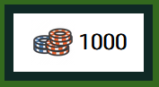

# Blackjack

[Blackjack](https://ocassidydev.github.io/blackjack/) is a simple web app game that allows the player to gamble virtual chips on blackjack, with a script as the dealer. The site will be targeted towards people who are looking to kill some time and have fun. Blackjack will be useful to anyone who would like to practice the basics of card counting to master this classic casino game. 

&nbsp;
## Features 

### Existing Features
- __About Page__
  - This is a page which appears when the user accesses the site. It tells the user what the site is for and why they might want to use it. 
  - Features a background image to give a straightforward indication of the site's purpose.
  - This is valuable to the user as it welcomes them to the website. 
  \
  &nbsp;
  

- __Central message boxes__

    - These are divs which appear and disappear for the user depending where the accompanying script is in its flow control.
    - Fixed in place at the center of the screen's interface so the user will easily see them.
    - The first message box welcomes the player and gives them their chips.
    - The second message box contains a form which allows the player to set their bet for that particular round.
    - The third message box is dynamic in its content, updating from the script depending on if the player get blackjack, wins, loses, or ties.
    - This will be valuable to the user as a means of conveying what is happening in the game, and immersing them in the blackjack experience.
    \
    &nbsp;
    
    

&nbsp;
- __Card boxes__

    - These are divs which are placed in fixed positions on the screen, with responsive sizing.
    - They show where cards will go when played, and accomodate card images when they are in play.
    - This will be valuable to the user as they give the feeling of a casino table and display the current cards in play.
    \
    &nbsp;
    

&nbsp;
- __Player controls__

  - These are a set of buttons which will only appear when the user needs to press them as input for the game.
  - Each button causes a unique set of events to occur in the accompanying script, representing the 3 options in a round of blackjack.
  - This feature will add value for the user by giving them a means of controlling their hand in the game.
  \
  &nbsp;
  

&nbsp;
- __Chip wallet__ 

  - This is a div containing the current number of chips that the player has.
  - The value within is dynamically updated from the accompanying javascript based on whether the player wins or loses bets.
  - This will add value to the user as they will be able to keep track of how much they have won or lost.
  \
  &nbsp;
  

&nbsp;
- __Current bet display__

  - This is a div containing the current bet value the player has made. 
  - The value within also dynamically updates from the accompanying javascript, using the value the user inputs in the form to set its value.
  - This will add value to the user as they will be able to remember what they bet during a round. 
  \
  &nbsp;
  

&nbsp;
- __Hand value display__ 

  - These are divs which contain the value of the hands of cards they are placed beside.
  - The values in these also dynamically update, showing the face value of all cards currently in the player/dealer's hand.
  - This will be valuable to the user as they will be more easily able to figure out what the current tally of their hand and the dealer's hand, especially if they are less familiar with the rules of blackjack.
  \
  &nbsp;
  

&nbsp;
- __The Footer__

  - The footer contains some social media links and a nice message.
  - The links utilize font awesome icons to give a minimalistic look.
  - This will be valuable to the user as a way of figuring out who made the site and what they can do with it.
  \
  &nbsp;
  

&nbsp;
### Features Left to Implement

&nbsp;

***Persistent chip wallet***

I wanted to implement a way to cache the user's current chip wallet in the browser, such that even if they close the tab or refresh it will still be there. This would also be accompanied by a different welcome message than the default, so that they realize they can pick up where they left off. One way to do this may be to let the user set a username as the first message box, which could then be saved as the name of a cookie which would then be retrieved if they put the same username in next time. The cookie could contain an object which would have the player's chip wallet stored on it.

&nbsp;

***Slowed sequential card dealing***

I also wanted to make the cards land on the table in a non-instantaneous, sequential fashion to give a more realistic card game feel. However, the way that my javascript was designed would make that very difficult to design. If I were to attempt it, I would try to implement a solution using promises, along with likely redesigning the flow control of much of startRound(), continueRound() and dealerPlay().
&nbsp;

***Card dealing animations***

I also wanted to add a means of having the cards animate as they appeared, preferably by moving from something graphical element that is stylized like a deck and to flip over from face down. This could be acheived in css at least in part, however until I can get cards to play sequentially doing this is redundant, the game would just skip to the round end messages while the player is still seeing card dealing animations and it would be too confusing. The same redesign as mentioned above would need to be implemented first.

&nbsp;

***Better card interface***
In it's current state, the way that this website displays the cards is not ideal for phone users. I would like to try and develop a better interface for displaying the cards being played that would be more compact and easier to make responsive. This would require a massive overhaul and refactoring of large portions of associated back-end logic however.

&nbsp;

***Nav bar in game page***
The lack of a navigation bar in the game page is a problem from a UX perspective as the user cannot navigate away from the page to the about page without using the back button on their browser. However, the interface of the game page is already quite crowded, so it was not possible to fit this in without a major redesign of the entire page. 

&nbsp;

## Testing 
### About page and nav bar
- The following table goes through each button and link that is in the about page and navigation bar
|Button/link            |Expected Behavior                                  |What Occurs                                        |Working as intended?   |
|:----------------------|:--------------------------------------------------|:--------------------------------------------------|:---------------------:|
|Play (button)          |Redirects to play.html                             |Redirects to play.html                             |✔                     |
|Play (link)            |Redirects to play.html                             |Redirects to play.html                             |✔                     |
|About                  |Redirects to index.html                            |Redirects to index.html                            |✔                     |

### Central message box
- The following table goes through each button that appears in the central message boxes, with columns detailing what the button should do when clicked, what it does when clicked, and a check to validate whether these buttons can be considered working or not.

|Button in box          |Expected Behavior                                  |What Occurs                                        |Working as intended?   |
|:----------------------|:--------------------------------------------------|:--------------------------------------------------|:---------------------:|
|Play Blackjack         |Gives 1000 chips and opens bet prompt              |Starts round and opens bet prompt                  |✔                     |
|Play again (lose)      |Clears table and opens bet prompt                  |Clears table and opens bet prompt                  |✔                     |
|Play again (win)       |Clears table and opens bet prompt                  |Clears table and opens bet prompt                  |✔                     |
|Play again (blackjack) |Clears table and opens bet prompt                  |Clears table and opens bet prompt                  |✔                     |
|Thanks                 |Gives 1000 chips, clears table and opens bet prompt|Gives 1000 chips, clears table and opens bet prompt|✔                     |
|Run away               |Refreshes page                                     |Refreshes page                                     |✔                     |

\
&nbsp;

### Bet input form
- The following table goes through each element of the bet input form, with columns detailing what the button should do when clicked, what it does when clicked, and a check to validate whether these buttons can be considered working or not.

|Element of form    |Expected Behavior                                                                                      |What Occurs                                                                                            |Working as intended?   |
|:------------------|:------------------------------------------------------------------------------------------------------|:------------------------------------------------------------------------------------------------------|:---------------------:|
|Number input       |Can only be set between 10 and 200 OR the chipwallet value, whichever is lowest, in increments of 10   |Can only be set between 10 and 200 OR the chipwallet value, whichever is lowest, in increments of 10   |✔                     |
|Submit bet! button |Updates bet value from form, closes message box, displays player controls and begins round             |Updates bet value from form, closes message box, displays player controls and begins round             |✔                     |

\
&nbsp;
### Player controls
- The following table goes through each button on player controls, with columns detailing what the button should do when clicked, what it does when clicked, and a check to validate whether these buttons can be considered working or not.

|Button on bar      |Expected Behavior                                                                                          |What Occurs                                                                                                |Working as intended?   |
|:------------------|:----------------------------------------------------------------------------------------------------------|:----------------------------------------------------------------------------------------------------------|:---------------------:|
|Stand              |Hides player controls and begins dealer's turn                                                             |Hides player controls and begins dealer's turn                                                             |✔                     |
|Hit!               |Hides double down button and adds one card to hand, then checks if hand >= 21, waits for user input if not |Hides double down button and adds one card to hand, then checks if hand >= 21, waits for user input if not |✔                     |
|Double down!       |Doubles bet value, hides player controls, checks if hand >= 21, begins dealer turn if not                  |Doubles bet value, hides player controls, checks if hand >= 21, begins dealer turn if not                  |✔                     |

\
&nbsp;

### Links
**Links in Footer**

These were checked across each page of the website.

|Link                                   |Expected Behavior                                                                      |What Occurs                                                                            |Working as intended?   |
|:--------------------------------------|:--------------------------------------------------------------------------------------|:--------------------------------------------------------------------------------------|:---------------------:|
|Github                                 |Opens [my Github](https://github.com/ocassidydev) in new tab                           |Opens [my Github](https://github.com/ocassidydev) in new tab                           |✔                     |
|LinkedIn                               |Opens [my LinkedIn](https://www.linkedin.com/in/oran-cassidy-48aa021b8/) in new tab    |Opens [my LinkedIn](https://www.linkedin.com/in/oran-cassidy-48aa021b8/) in new tab    |✔                     |

&nbsp;

### Different viewports
Throughout the project, the appearance of the website was checked using firefox dev tools set devices. I also quickly browsed through the finished site on my phone.

&nbsp;
### Bugs 

  - Bug where if the player ran out of chips and was given the message giving them more, the button in the end message in subsequent rounds had "Thanks" as the text rather than "Play again"
  - On certain small viewports, the card slots show up as taking more space than the page width and one ends up getting displaced below the others, despite this not being the case on other similarily size viewports and in dev tools.
  - Although the array of cards in the deck is shuffled using the Fisher-Yates method as opposed to Math.random(), it seems this doesn't significantly increase the randomness of the deck either way. Different suits seem highly correlated. Might be some way to generate the list of card objects more randomly, such as passing an array 1 through 13 that itself has been shuffled first for the deck constructor.
  - Bug where if player has < 400 chips, if the player doubled down on a bet where the value was twice that of their remaining chips they would have negative chips and the game would bug out 

&nbsp;
### Validator Testing 

- HTML
  - Errors were returned when passing through the official [W3C validator](https://validator.w3.org/nu/?doc=https%3A%2F%2Focassidydev.github.io%2Fblackjack%2F), however all of these relate to the various pieces of dynamic content in the page (messages that would hvae different content depending on win, loss, etc., the slots where the card images would load). In future, I will try to design my web applications to be more compliant with the accepted best practice. However, none of these errors seem to harm the overall function of the website.
- CSS
  - No errors were found when passing through the official [(Jigsaw) validator](https://jigsaw.w3.org/css-validator/validator?uri=https%3A%2F%2Focassidydev.github.io%2Fblackjack%2F&profile=css3svg&usermedium=all&warning=1&vextwarning=&lang=en)
- Lighthouse
  - The site had an exceptional lighthouse score, at 99 for performance, 100 for accessibility, 100 for best practices and 92 for SEO. 

&nbsp;
### Unfixed Bugs
   
&nbsp;
## Deployment

- This project was deployed through github pages at this [link](https://ocassidydev.github.io/blackjack/), using the following steps:

  - From the github repository, navigated to settings
  - Clicked on "Pages" 
  - On the drop down menu that read "none", clicked and changed to "main"
  - Clicked save

&nbsp;

- For local deployment, run the following command:

      git clone https://github.com/ocassidydev/blackjack.git

&nbsp;
## Credits 

### Code

- The card Fisher-Yates code block in the deck class's shuffle method was created using an answer from an answer on [Stack Overflow](https://stackoverflow.com/questions/64925666/how-can-i-sort-an-array-randomly-in-javascript).
- CSS code for centering elements on the page was obtained from this answer on [StackOverflow](https://stackoverflow.com/questions/1776915/how-can-i-center-an-absolutely-positioned-element-in-a-div).
- Figuring out how to make the logic for handling aces in the game was found using this answer on [StackOverflow](https://stackoverflow.com/questions/13518758/how-to-decide-when-ace-should-count-as-1-or-11-in-blackjack-game)
- To build the javascript, [Python Tutor](https://pythontutor.com/) was used to visualize the data structures and do some initial debugging.
- For refreshing certain concepts and documentations, I used [W3S Schools](https://www.w3schools.com/).
- To build the nav bar and about page, code was taken from the Code Institute Love Running walkthrough project

&nbsp;
### Content 

- [Blackjack.org](https://www.blackjack.org/blackjack/how-to-play/) was used to make myself aware of the rules to create a simplified version of the game.
- The icons in the footer were taken from [Font Awesome](https://fontawesome.com/).
- [RedKetchup](https://redketchup.io/image-resizer) was used to resize and crop images to be used.

&nbsp;
### Media

The following lists all groups of assets in the /assets/images folder, with a link to the site they were taken from. Where possible, they are listed in order of appearance.

  - chips-icon - [Iconfinder](https://www.iconfinder.com/icons/1094418/casino_chip_chips_game_poker_poker_chips_stack_icon)
  - bet-icon - [Iconfinder](https://www.iconfinder.com/icons/508155/bet_betting_coin_hand_pay_place_bet_poker_chip_icon)
  - hand-icon - [Noun Project](https://thenounproject.com/browse/icons/term/playing-cards/?iconspage=1)
  - All card assets - [itch.io](https://gamesupply.itch.io/frenchcard)
  - Blackjack table image on main page [Game Tables and More](https://www.gametablesonline.com/blog/blackjack-beginners/)